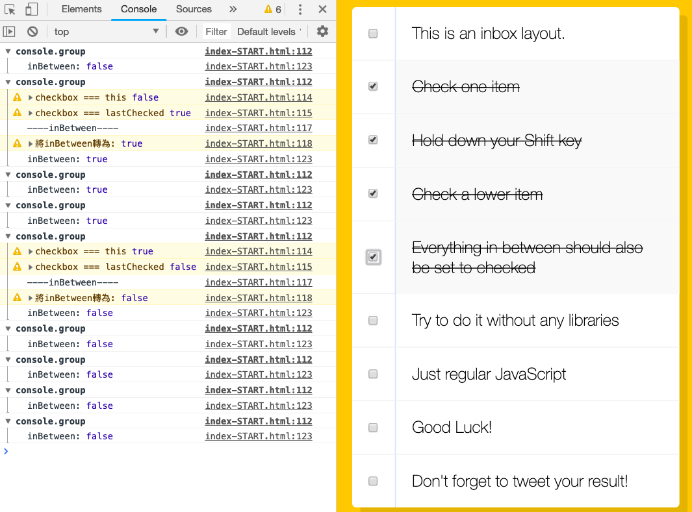

# 10 - Hold Shift and Check Checkboxes

### 功能說明
* 點選一個checkbox，之後按下`shift`鍵並點選其他checkbox，可將中間的checkbox都選起來

### 功能開發邏輯說明
1. lastChecked用來儲存最後一個被點的checkbox元素
2. 當`if(e.shiftKey && this.checked)`啟動，代表點擊checkbox時shift鍵也同時被按下。此時開始迭代整個**checkboxes.forEach()**
3. 將inBetween的初始值設定為false，透過`if(checkbox === this || checkbox === lastChecked)`來找到被選取的範圍(inBetween)
4. inBetween邏輯的轉換可參考以下的console畫面
  * 請參考下方：inBetween邏輯輔佐圖（如想參考原始碼，可將console註解解開）
    * 每一次迭代用console.group包起來，方便檢視。
    * 當`if(checkbox === this || checkbox === lastChecked)`其中一個為true，就將between設為true，between會一直為true直到遇到`checkbox === this`為true。
    * 即可透過以下程式碼將checkbox勾選起來
      ```
        if (inBetween) {
          checkbox.checked = true;
        }
      ```
### inBetween邏輯輔佐圖
